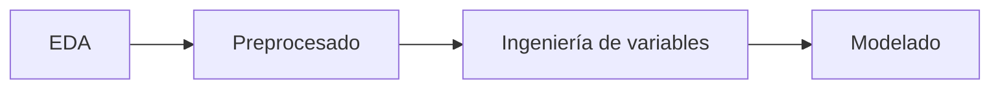

## [Descripción General](../README.md)
## [EDA](../data_exploration/exploration.md)
## [Preprocesado](../preprocessing/cleaning.md)
## [Creación de Características](../feature_creation/features.md)
## [Modelado ML](../model_building/model.md)
# Conclusión

---

## Conclusión

## 1. Resumen ejecutivo

Se construyó un flujo completo para predecir `Price` en Airbnb: 

El mejor desempeño provino de `RandomForestRegressor()` con MAE=17.11€ y Scoretest ± 0.610, superando a un `DesicionTreeRegressor()` baseline MAE=20.21€, Scoretest ± 0.496.

## 2. Hallazgos
- `Bedrooms`, `Accommodates`, `Cleaning Fee` y `Bathrooms` son las variables con mayor contribución. El tipo de habitación (`Entire home/apt`) y el contexto de barrio (codificado por media) también son influyentes.
- La distribución de `Price` es asimétrica con unos pocos outliers altos; Gracias a la normalización, MAE es apropiado.
- El control de colinealidad y de cardinalidad categórica ayudó a reducir ruido y a estabilizar importances.
- Con separación de `Amenities` sí se pudo determinar la importancia que tienen unas sobre otras.

## 3. Desempeño del modelo
- Baseline Decision Tree: MAE=20.21€, Scoretest ± 0.496.
- Random Forest: MAE=17.11€, Scoretest ± 0.610.

Mejora relativa = 15.3% en MAE respecto al baseline, consistente con la implementación de un modelo con capacidad para capturar no linealidades e interacciones particulares.

## 4. Limitaciones
- Falta un pipeline integrado sin manipulación manual.
- No se evaluó `log1p(Price)` ni modelos de gradient boosting; existe margen de mejora.
- Variables categóricas de texto como reviews pueden ser procesadas con NLP.

## 5. Aprendizajes y TO-DO 
1. Incorporar Pipeline y persistencia del modelo.
2. Probar variante con `log1p(Price)` y comparar MAE.
3. Extender benchmark con XGBoost/LightGBM y búsqueda bayesiana.

## 6. Cierre
El proyecto deja una base sólida. Con las correcciones señaladas y más iteraciones de ingeniería de características es razonable **y muy esperable** aspirar a mejoras adicionales en el MAE.