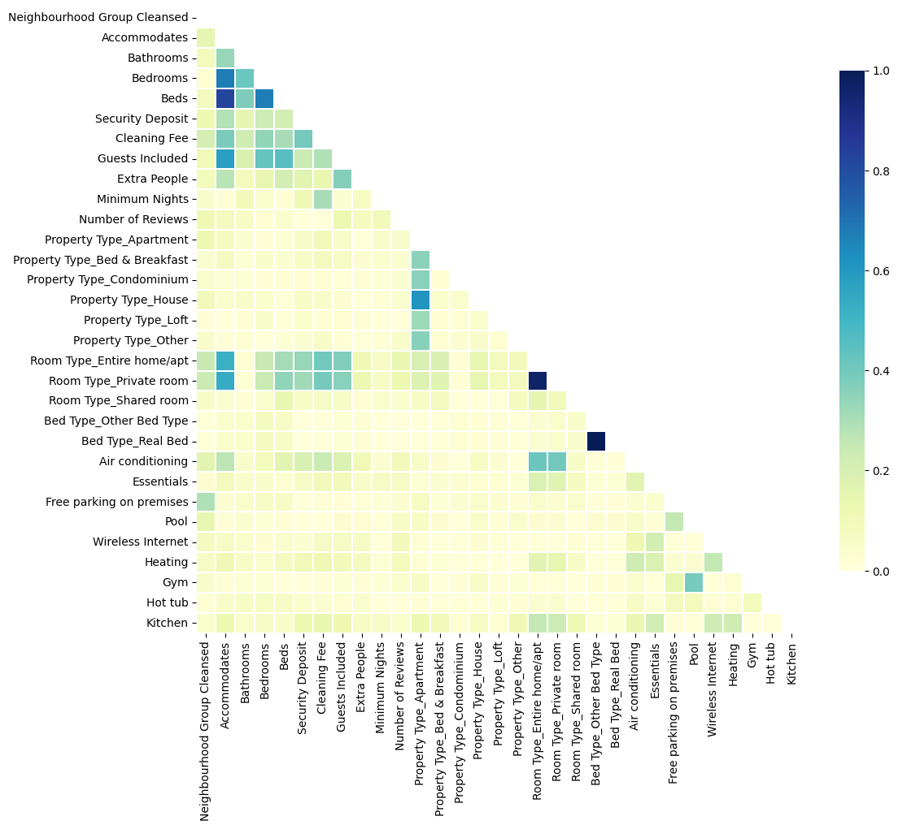
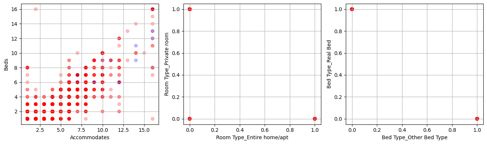

## [Descripción General](../README.md)
# EDA
## [Preprocesado](../preprocessing/cleaning.md)
## [Creación de Características](../feature_creation/features.md)
## [Modelado ML](../model_building/model.md)
## [Conclusión](../conclusion/conclusion.md)

---

## Exploración de datos (EDA)

La exploración se centra en comprender la estructura, la calidad y las relaciones iniciales del dataset con la variable objetivo **`Price`**.

## 1. Estructura y calidad de datos

Tamaño y columnas tras descarte inicial de columnas no informativas
- Filas: 9.898
- Columnas: 17
> Notebook: Python cell #5 `drop`.

Cobertura y tipos relevantes post-drop:

| #  | Column                          | Non-Null Count | Dtype   |
|----|---------------------------------|----------------|---------|
| 0  | Neighbourhood Group Cleansed    | 9898 non-null  | object  |
| 1  | Property Type                   | 9898 non-null  | object  |
| 2  | Room Type                       | 9898 non-null  | object  |
| 3  | Accommodates                    | 9898 non-null  | int64   |
| 4  | Bathrooms                       | 9860 non-null  | float64 |
| 5  | Bedrooms                        | 9860 non-null  | float64 |
| 6  | Beds                            | 9860 non-null  | float64 |
| 7  | Bed Type                        | 9898 non-null  | object  |
| 8  | Amenities                       | 9819 non-null  | object  |
| 9  | Square Feet                     | 398 non-null   | float64 |
| 10 | Price                           | 9898 non-null  | float64 |
| 11 | Security Deposit                | 4262 non-null  | float64 |
| 12 | Cleaning Fee                    | 5543 non-null  | float64 |
| 13 | Guests Included                 | 9898 non-null  | int64   |
| 14 | Extra People                    | 9898 non-null  | int64   |
| 15 | Minimum Nights                  | 9898 non-null  | int64   |
| 16 | Number of Reviews               | 9898 non-null  | int64   |

**Hallazgo**: `Square Feet` presenta muy pocos datos, ±4%, y con posterior análisis se determina que también tiene alta variabilidad. Se elimina para evitar ruido y sesgos de imputación.
> Notebook: Python cell #8 varianza consultada; cell #9 (drop)

## 2. Estadística descriptiva de variable dependiente 

**`Price`**
- count: 9.898
- min: **9**
- Q1: 30
- mediana: 52
- Q3: 80
- max: **875**
- media: 65,61
Interpretación: media>mediana → asimetría positiva. Existen **valores extremos altos**.

## 3. Decisiones y pruebas exploratorias sobre variables

### 3.1. Normalización de valores extremos en `Minimum Nights`
Se capan valores >31 sustituyéndolos por la mediana robusta a outliers; la mediana es 2.
```python
train['Minimum Nights'] = np.where(train['Minimum Nights'] > 31,
                                   train['Minimum Nights'].median(),
                                   train['Minimum Nights'])
```
Motivación: Control de valores extremos catalogados como Outliers y podrían distorsionar relaciones con el precio.  
> Notebook: Python cell #12.

### 3.2. Consolidación de categorías poco frecuentes
- `Property Type`: se agrupan categorías minoritarias en **`Other`** para reducir cardinalidad.
```python
train['Property Type'] = np.where(train['Property Type'].isin(['Apartment', 'House', 'Condominium', 'Bed & Breakfast', 'Loft', 'Other']),
                                  train['Property Type'],
                                  'Other')
```
> Notebook: Python cell #14.
 
- `Bed Type`: se fuerza esquema binario **`Real Bed`** vs **`Other Bed Type`**.
```python
train['Bed Type'] = np.where(train['Bed Type'] == 'Real Bed',
                             train['Bed Type'],
                             'Other Bed Type')
```
> Notebook: Python cell #16.

Resultado esperado: codificación más estable y reducción de ruido por clases con muy pocos registros.  

### 3.3. Señales iniciales por barrio
Se calcula la media de `Price` por `Neighbourhood Group Cleansed`. No se fijan conclusiones numéricas por tratarse de inspección preliminar.  

### 3.4. Ingeniería preexploratoria de comodidades  
A partir de una lista filtrada de comodidades, se generan indicadores binarios de presencia/ausencia (1/0) para facilitar lectura correlacional posterior.  

## 4. Correlaciones y colinealidad

Se evalúa la matriz de correlaciones entre características (excluyendo `Price` en el mapa de calor) y se inspeccionan pares con alta colinealidad usando un umbral de 0,80:
### - Mapa de calor: detectando variables redundantes:
```python
corr = np.abs(train.drop(['Price'], axis=1).corr())
mask = np.zeros_like(corr, dtype=bool)
mask[np.triu_indices_from(mask)] = True
f, ax = plt.subplots(figsize=(12, 10))
sns.heatmap(corr, mask=mask,vmin = 0.0, vmax=1.0, center=0.5,
            linewidths=.1, cmap="YlGnBu", cbar_kws={"shrink": .8})
plt.show()
```


### - Pares > 0,80: se representan en dispersogramas coloreados por `Price` para evaluar redundancia:
```python
corr_matrix = train.corr().abs()
upper = corr_matrix.where(np.triu(np.ones(corr_matrix.shape), k=1).astype(bool))
threshold = 0.80
pairs = np.where(upper>threshold)
fx = train.columns[pairs[0]]
fy =  train.columns[pairs[1]]
i=1
plt.figure(figsize=(22,4))
for f1,f2 in zip(fx,fy):
    plt.subplot(1,5,i)
    plt.scatter(train[f1],train[f2], c=train['Price'],cmap=cm_bright, alpha=0.25)
    plt.xlabel(f1)
    plt.ylabel(f2)
    plt.grid()
    plt.tight_layout()
    i+=1
plt.show()
```


- Acción concreta: se elimina `Room Type_Private room` y `Beds` como depuración de colinealidad.  

> Notebook: Python cell #20 heatmap sin `Price`; cell #21 pares con `threshold = 0.80`; cell #22 drop de variables colineal.

## 5. Observaciones clave del EDA (para guiar el preprocesado y el modelado)

1. `Price` es asimétrica con outliers altos → considerar transformaciones en modelado.  
2. Dificultades de cobertura en variables monetarias `Security Deposit`, `Cleaning Fee`, `Square Feet` → evitar imputaciones agresivas; en particular, `Square Feet` se elimina.
3. Cardinalidad categórica controlada en `Property Type`, `Bed Type` → consolidación previa mejora nro. de dummies.
4. Imputación `Price` por barrio.
5. Selección de `Ammenities` se profundizará al seleccionar características.
6. Colinealidad: se detectan pares>0,80 y se eliminan dos variables considerablemente redundantes.