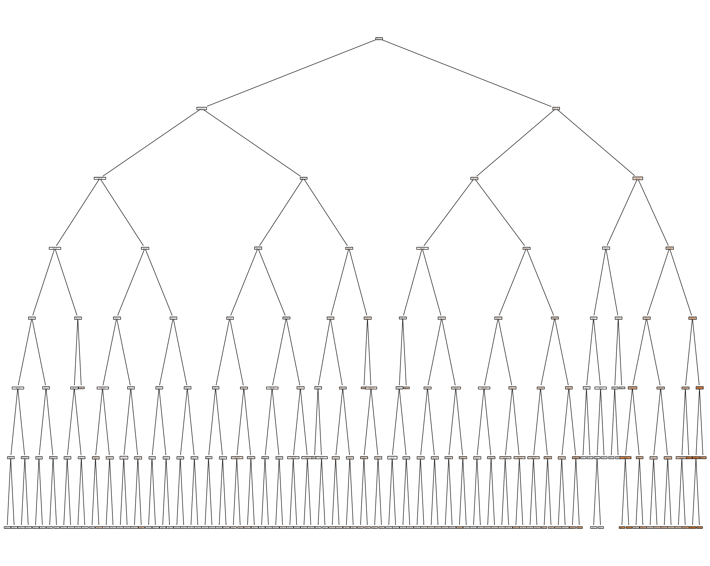
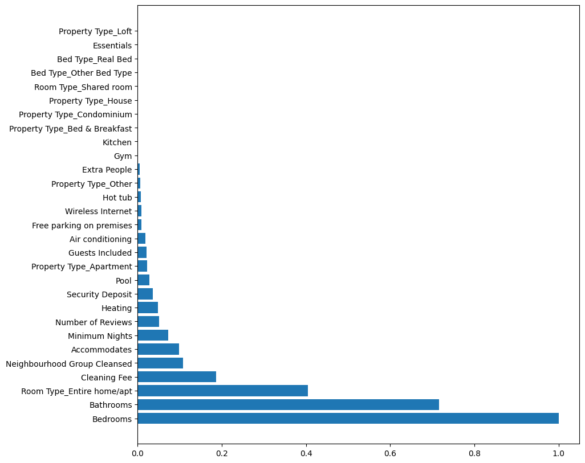
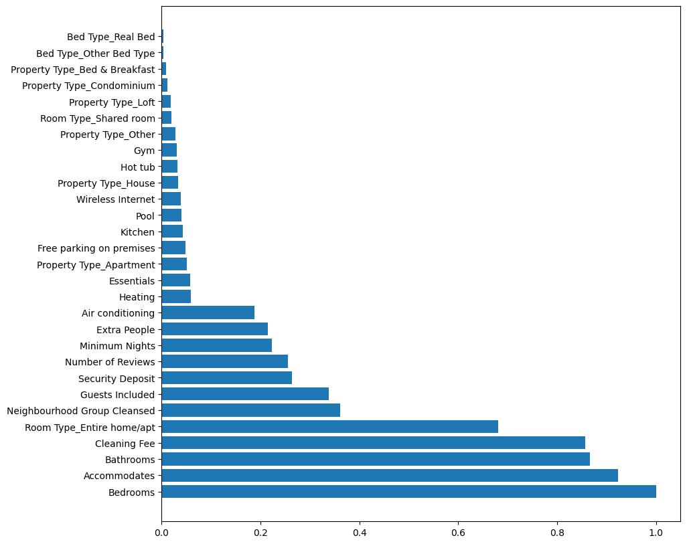
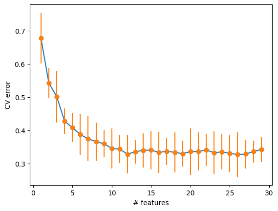

## [Descripción General](../README.md)
## [EDA](../data_exploration/exploration.md)
## [Preprocesado](../preprocessing/cleaning.md)
# Creación de Características
## [Modelado ML](../model_building/model.md)
## [Conclusión](../conclusion/conclusion.md)

---

## Creación y Selección Avanzada de Características
Esta sección documenta la ingeniería de variables aplicada sobre el dataset y el flujo de selección avanzada de características utilizado para el [modelado](../model_building/model.md).

Todas las decisiones están trazadas al notebook.

## 1. Ingeniería de variables

### 1.1. Codificación variables categóricas
Se aplicó `one‑hot encoding` a:
- `Property Type`
- `Room Type`
- `Bed Type`

```python
train = pd.get_dummies(train, columns = ['Property Type'])
train = pd.get_dummies(train, columns = ['Room Type'])
train = pd.get_dummies(train, columns = ['Bed Type'])
```
> Notebook: Python cell #17.

### 1.2. Codificación por media de precio de barrio
Se realizó el `target/mean encoding` reemplazando los valores de `Neighbourhood Group Cleansed` por su media agrupada de `Price` para capturar valores relacionados con lo geoespacial.

```python
price_mean = train.groupby('Neighbourhood Group Cleansed')['Price'].mean().to_dict()
train['Neighbourhood Group Cleansed'] = train['Neighbourhood Group Cleansed'].map(price_mean)
```
> Notebook: Python cell #18.

### 1.3. Codificación binaria de comodidades `Amenities`
Desde columna `Amenities` se generaron columnas binarias basado en una lista arbitrariamente elegida y nombrada como `amenities_importantes[]` que incluye: 

| # | Comodidad |
| - | - |
| 1 | Air conditioning |
| 2 | Essentials |
| 3 | Free parking on premises |
| 4 | Pool |
| 5 | Wireless Internet|
| 6 | Heating |
| 7 | Gym |
| 8 | Hot tub |
| 9 | Kitchen |

Luego se descarta la columna original `Amenities` para reducir cardinalidad.

```python
for a in amenities_importantes:
    train[a] = train['Amenities'].fillna('').str.contains(a).astype(int)
train.drop('Amenities', axis=1, inplace=True)
```
> Notebook: Python cell #19.

### 1.4. Simulación de Pipeline en `test`
Garantizando consistencia entre conjuntos de entrenamiento y prueba, se aplicaron en el `test` las mismas transformaciones utilizadas en el `train`.

```python
test.drop([...], axis = 1, inplace = True)
test.drop('Square Feet', axis = 1, inplace = True)
test['Security Deposit'] = test['Security Deposit'].fillna(0)
test['Cleaning Fee'] = test['Cleaning Fee'].fillna(0)
test['Bathrooms'] = test['Bathrooms'].fillna(test['Bathrooms'].median())
test['Bedrooms'] = test['Bedrooms'].fillna(test['Bedrooms'].median())
test['Beds'] = test['Beds'].fillna(test['Beds'].median())

test['Minimum Nights'] = np.where(test['Minimum Nights'] > 31,
                                  test['Minimum Nights'].median(),
                                  test['Minimum Nights'])

test['Property Type'] = np.where(test['Property Type'].isin([...]),
                                  test['Property Type'],
                                  'Other')

test['Bed Type'] = np.where(test['Bed Type'] == 'Real Bed',
                             test['Bed Type'],
                             'Other Bed Type')

test = pd.get_dummies(test, columns = ['Property Type'])
test = pd.get_dummies(test, columns = ['Room Type'])
test = pd.get_dummies(test, columns = ['Bed Type'])
price_mean = test.groupby('Neighbourhood Group Cleansed')['Price'].mean().to_dict()
test['Neighbourhood Group Cleansed'] = test['Neighbourhood Group Cleansed'].map(price_mean)

for amenity in amenities_importantes:
    test[amenity] = test['Amenities'].fillna('').str.contains(amenity).astype(int)
test.drop('Amenities', axis=1, inplace = True)
test.drop('Room Type_Private room', axis = 1, inplace = True)
test.drop('Beds', axis = 1, inplace = True)

X_test = test.drop('Price', axis = 1)
y_test = test['Price']
```
> Notebook: Python cell #24.

## 2. Baseline `DecisionTreeRegressor()`
Se entrenó un Árbol de Decisión `DecisionTreeRegressor()` como baseline y con él, se calcularon las importancias para todas las características en columna `X_train`.



#### 2.1 Primera estimación de importancias



## 3. Modelado Final `RandomForestRegressor()`
Se recalculó el ranking de importancias con un modelo más robusto para selección de múltiples características como lo es el `RandomForestRegressor()`

```python
importances = randomForest.feature_importances_
importances = importances / np.max(importances)
indices = np.argsort(importances)[::-1]
plt.figure(figsize=(10,10))
plt.barh(range(X_train.shape[1]),importances[indices])
plt.yticks(range(X_train.shape[1]),nombre_columnas[indices])
plt.show()
```



> Notebook: Python cell #32.

### 3.1. Selección avanzada de características (top‑k)
Con ayuda de la `CrossValidation KFold` se busca determinar de manera contundente la selección de características y responder con datos "*¿Cuántas variables son realmente necesarias para obtener un buen desempeño en el `RandomForestRegressor()`, y evitar caer en la maldición de la cardinalidad evitando complejidad en el modelo?*"

Lo anterior, se desarrolló siguiendo los siguientes pasos <sub>*explicado a alto nivel*</sub> :
1. Se entrena `RandomForestRegressor()` y se define espacios `KFold`.
2. La validación cruzada empieza mediante un bucle `for` encargado de evaluar los subconjuntos del `train` separados por el `KFold`.
3. La importancia de las variables se va agregando y ajustando en una lista `indices[]`, que es una variable global la cual se sobrescribe y se va ajustando en este bucle for.
4. El resultado es, precisamente, esta lista `indices[]` y una gráfica curva de error de validación donde:
    - Eje X: Es el nro de características.
    - Eje Y: Error en `CrossValidation`, donde menor error=mejor.
    - Curva: Tendencia del error al añadir variables.
    - Barras naranjas: Desviación estandar.

```python
N,Nfeatures = X_train.shape
rf = RandomForestRegressor(max_depth=maxDepthOptimo,n_estimators=200,max_features='sqrt')

kf  = KFold(n_splits=10, shuffle = True)

cv_error = []
cv_std = []

for nfeatures in range(Nfeatures,0,-1):
    error_i = []

    for idxTrain, idxVal in kf.split(X_train):
        Xt = X_train.iloc[idxTrain,:]
        yt = y_train.iloc[idxTrain]
        Xv = X_train.iloc[idxVal,:]
        yv = y_train.iloc[idxVal]
        
        rf.fit(Xt,yt)
        
        ranking = rf.feature_importances_
        indices = np.argsort(ranking)[::-1]
        selected = indices[0:(Nfeatures-nfeatures+1)]
        Xs = Xt.iloc[:,selected]

        rf.fit(Xs,yt)
        
        error = (1.0-rf.score(Xv.iloc[:,selected],yv))
        error_i.append(error)

    cv_error.append(np.mean(error_i))
    cv_std.append(np.std(error_i))
```



> Notebook: Python cell #33-34

## 4. Resultado final
Con la selección de características anteriormente descrita, se llegó al siguiente ranking, de más a menos importante:

| # Importancia | Característica |
| - | - |
| #1 | Bedrooms |
| #2 | Accommodates |
| #3 | Cleaning Fee |
| #4 | Bathrooms |
| #5 | Room Type_Entire home/apt |
| #6 | Neighbourhood Group Cleansed |
| #7 | Guests Included |
| #8 | Security Deposit |
| #9 | Number of Reviews |
| #10 | Minimum Nights |
| #11 | Air conditioning |
| #12 | Extra People |
| #13 | Heating |
| #14 | Essentials |