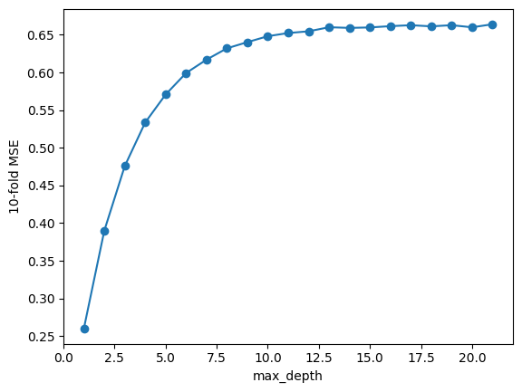

## [Descripción General](../README.md)
## [EDA](../data_exploration/exploration.md)
## [Preprocesado](../preprocessing/cleaning.md)
## [Creación de Características](../feature_creation/features.md)
# Modelado ML
## [Conclusión](../conclusion/conclusion.md)

---

## Modelado Machine Learning

Construir modelos de regresión para predecir `Price` en anuncios de Airbnb.

Explicar decisiones de diseño, validación, métricas y resultados intermedios y finales.


## 1. Alcance y supuestos del modelado
- Variable objetivo: `Price` en Euros.
- Partición: `train_test_split(test_size=0.25)`.
- Métrica principal: Error absoluto medio MAE.
- Lineamientos: todo preprocesado y creación de características se definen fuera del modelado y se aplican de forma idéntica a `train` y `test` (ver [`cleaning.md`](../preprocessing/cleaning.md) y [`features.md`](../feature_creation/features.md)).

## 2. Datos de entrada al modelado
El conjunto `X/_train/_test` incluye variables numéricas y dummies; `y/_train/_test = Price`. Decisiones previas a tener en cuenta:
- Eliminación de `Square Feet` por baja cobertura y alta variabilidad.
- Capado de outliers de `Minimum Nights` (>31 → mediana=2).
- Consolidación de categorías: 
    - `Property Type`, agrupar minoritarias en `Other`
    - `Bed Type`, conversión a tipo: `Real Bed` vs `Other Bed Type`.
- Ingeniería de `Amenities`, indicadores dummies para comodidades frecuentes.
- `Neighbourhood Group Cleansed` mediante *mean/target encoding*.

## 3. Árbol de Decisión `DecisionTreeRegressor()` - Baseline
Punto de comparación simple y rápido para insights efectivos. Implementado con búsqueda de hiperparámetros GridSearchCV.

```python
from sklearn.tree import DecisionTreeRegressor
from sklearn.model_selection import GridSearchCV

maxDepth_DT = range(1,15)
param_grid = {'max_depth': range(1, 15)}
grid = GridSearchCV(DecisionTreeRegressor(), param_grid=param_grid, cv = 10)
grid.fit(X_train, y_train)

maxDepthOptimo_DT = grid.best_params_['max_depth']
treeModel = DecisionTreeRegressor(max_depth=maxDepthOptimo_DT).fit(X_train,y_train)

y_predict = treeModel.predict(X_test)

MAE_tree = mean_absolute_error(y_test, y_predict)
```

Resultados
- `treeModel.score(X_train,y_train)` ± 0.707
- `treeModel.score(X_test,y_test)` ± 0.496.
- MAE test = 20.21 Euros.

Conclusión: el baseline capta estructura por el casi 50% de precisión en test, pero sufre de varianza y falta de poder predictivo fuera de muestra.

## 4. Bosque Aleatorio `RandomForestRegressor()` - Modelo principal

¿Por qué un Random Forest?

Posee robustez ante no linealidad, interacciones con multiples combinaciones de variables y manejo de outliers moderados.

### 4.1 Primera estimación, sin selección de características

Búsqueda y ajuste
```python
from sklearn.ensemble import RandomForestRegressor
from sklearn.model_selection import GridSearchCV, KFold

maxDepth_rf = range(1,22)
tuned_parameters_rf = {'max_depth': maxDepth_rf}
grid_rf = GridSearchCV(RandomForestRegressor(random_state=0, n_estimators=200, max_features='sqrt'), param_grid=tuned_parameters_rf,cv=5, verbose=2)
grid_rf.fit(X_train, y_train)

maxDepthOptimo = 14 # ↓ Ver gráfico de abajo para entender por qué 14 ↓
```



```python
randomForest = RandomForestRegressor(max_depth=maxDepthOptimo,n_estimators=200,max_features='sqrt').fit(X_train,y_train)

print("Train: ",randomForest.score(X_train,y_train))
print("Test: ",randomForest.score(X_test,y_test))
```

Resultados 
- `randomForest.score(X_train,y_train)` ± 0.866
- `randomForest.score(X_test,y_test)` ± 0.602. 

Interpretación de modelo parcial: mejora consistente frente al baseline.

### 4.2 Selección avanzada de características (top‑k con CV)
Determinar cuántas variables maximizan desempeño.

Minimizar complejidad (Evitar *maldición de dimensionalidad*).

```python
from sklearn.model_selection import KFold
N,Nfeatures = X_train.shape
rf = RandomForestRegressor(max_depth=maxDepthOptimo,n_estimators=200,max_features='sqrt')

kf = KFold(n_splits=10, shuffle = True)

cv_error = []
cv_std = []

for nfeatures in range(Nfeatures,0,-1):
    error_i = []

    for idxTrain, idxVal in kf.split(X_train):
        Xt = X_train.iloc[idxTrain,:]
        yt = y_train.iloc[idxTrain]
        Xv = X_train.iloc[idxVal,:]
        yv = y_train.iloc[idxVal]
        
        rf.fit(Xt,yt)
        
        ranking = rf.feature_importances_
        indices = np.argsort(ranking)[::-1]
        selected = indices[0:(Nfeatures-nfeatures+1)]
        Xs = Xt.iloc[:,selected]

        rf.fit(Xs,yt)
        
        error = (1.0-rf.score(Xv.iloc[:,selected],yv))
        error_i.append(error)

    cv_error.append(np.mean(error_i))
    cv_std.append(np.std(error_i))
```

Top‑k de mayor a menor:

| # Importancia | Característica |
| - | - |
| #1 | Bedrooms |
| #2 | Accommodates |
| #3 | Cleaning Fee |
| #4 | Bathrooms |
| #5 | Room Type_Entire home/apt |
| #6 | Neighbourhood Group Cleansed |
| #7 | Guests Included |
| #8 | Security Deposit |
| #9 | Number of Reviews |
| #10 | Minimum Nights |
| #11 | Air conditioning |
| #12 | Extra People |
| #13 | Heating |
| #14 | Essentials |

### 4.3 Segunda estimación, con selección de características

```python
selected_features = indices[0:14]
maxDepthOptimo = 14

randomForest = RandomForestRegressor(max_depth=maxDepthOptimo,n_estimators=200,max_features='sqrt').fit(X_train.iloc[:, selected_features], y_train)

y_predict_rf = randomForest.predict(X_test.iloc[:, selected_features])

MAE_rf = mean_absolute_error(y_test, y_predict_rf)

print("Train: ",randomForest.score(X_train.iloc[:, selected_features],y_train))
print("Test: ",randomForest.score(X_test.iloc[:, selected_features],y_test))
print('Media del error en datos de test: ' + str(round(MAE_rf,2)) + ' Euros.')
```
Resultados
- `randomForest.score(X_train,y_train)` ± 0.874
- `randomForest.score(X_test,y_test)` ± 0.609.
- MAE test = 17.11 Euros.


## 5) Resultados agregados y trazabilidad
- Baseline Árbol: MAE = 20.21 €, Score test ± 0.496.
- Random Forest: MAE ≈ 17.11 €, Score test ± 0.610.